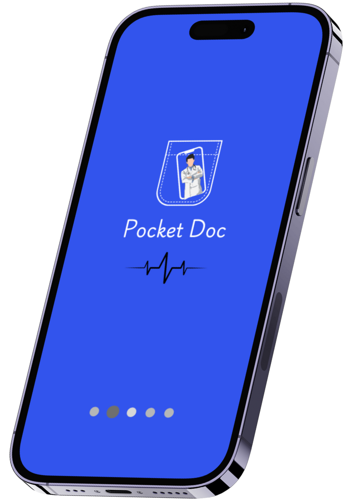
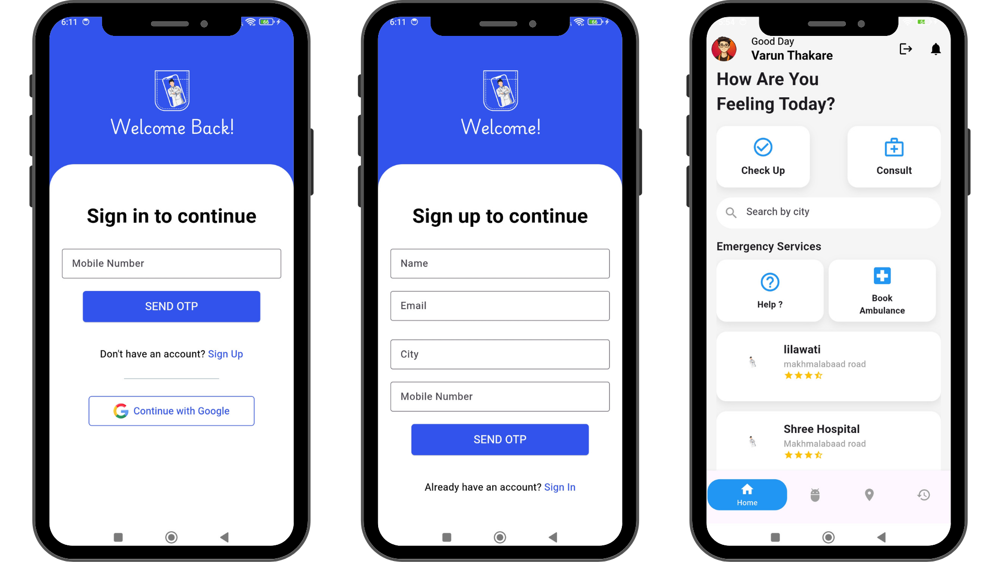
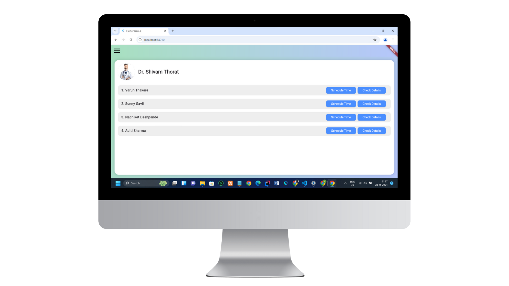
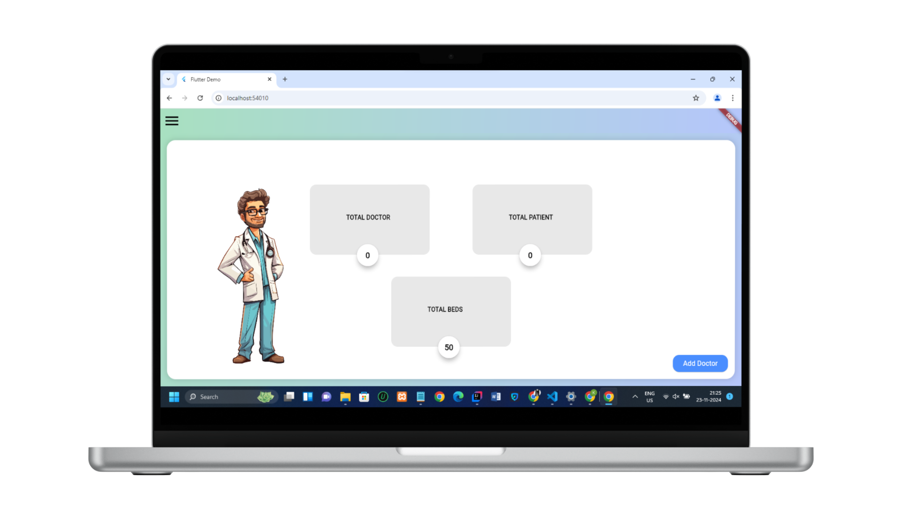

# Pocket Doctor - Healthcare Appointment & Emergency Service


## Overview


Pocket Doctor is an easy-to-use healthcare management app that helps users book doctor appointments, access their medical history, and request emergency ambulance services. It allows users to book appointments with doctors at convenient times, reducing waiting time. The app also lets users, especially senior citizens, store and view their medical records, making it easier for doctors to provide better care. In case of emergencies, the app has a one-tap ambulance booking feature that quickly finds and sends the nearest ambulance to the user’s location. Pocket Doctor aims to make healthcare processes simpler, improve patient experiences, and provide fast help during emergencies. The app is built using Flutter for the mobile interface and Spring Boot for the backend, ensuring smooth and reliable performance. 


## Key Features
- Doctor Appointment Scheduling - Patients can book appointments with doctors based on availability, with real-time confirmation.

- One-Tap Emergency Ambulance Service - Users can request emergency ambulances, with automatic dispatch based on the user's location.

- Comprehensive Medical History - A feature for senior citizens to maintain a digital medical history, allowing doctors to access critical health information for effective treatment.

- Fraud Detection (AI-powered) - An AI-powered feature to help users detect potential fraud or suspicious activity related to their medical services.



## Tech Stack:


- Frontend - Flutter for building cross-platform mobile applications with a native performance.

- Backend - Spring Boot for creating robust and scalable RESTful APIs.

- Database - MySQL for relational data storage.

- AI - Machine learning algorithms for fraud detection and analysis.

- Firebase for push notifications, Google Maps API for location-based services, Twilio for SMS notifications.

<br>

## Contributors


[](https://github.com/shivammm21)
[](https://github.com/varunthakare)
[](https://github.com/PranitDhumal08)

## Installation
### Prerequisites
- Java (JDK 11 or higher)
- Spring Boot (Backend)
- Flutter (Frontend)
- MySQL Database
- Firebase Account (for push notifications)
- Google Maps API Key (for ambulance location tracking)
- Twilio Account (for SMS notifications)

## Backend Setup (Spring Boot)


- **To run the Spring Boot application, make sure you have Maven or Gradle installed, or let your IDE handle the build process.**
    - **Clone the repository:**
        ```bash
          git clone https://github.com/yourusername/pocket-doctor-backend.git
    - **Navigate to the project directory:**

        ```bash
            cd pocket-doctor-backend
    - **Clone the repository:**
        ```bash
          git clone https://github.com/yourusername/pocket-doctor-backend.git
    - **Set up the MySQL database and configure the application.properties file with your database credentials.**
    - **Build the project:**
        ```bash
            mvn clean install
    - **Run the application**
        ```bash
          mvn spring-boot:run

## Frontend Setup (Flutter)  


- **To run the Flutter Application, make sure you have vs-COde or Android Studio installed.**
    - **Clone the repository:**
        ```bash
          git clone https://github.com/yourusername/pocket-doctor-flutter.git
    - **Navigate to the project directory:**

        ```bash
            cd pocket-doctor-flutter
    - **Install dependencies:**
        ```bash
          flutter pub get
    - **Set up your Firebase and Google Maps API keys in the lib/config.dart file.**
    - **Run the app on an emulator or physical device:**
        ```bash
            flutter run

##  Features in Detail:

### Doctor Appointment Scheduling

- Allows users to book appointments with available doctors, ensuring real-time scheduling and confirmation.
- Appointment data is stored securely in the database and accessible by both users and doctors.

### One-Tap Emergency Ambulance Service

- Enables users to request an ambulance with a single tap, using the user's location to dispatch the nearest available ambulance.
- Real-time notifications are sent to both the user and the ambulance service for quick action.

### Medical History for Senior Citizens

- Provides a digital record for senior citizens to store and manage their medical history, including chronic conditions and treatments.
- Doctors can easily access and review this data during appointments for better diagnosis and treatment planning.

### Fraud Detection

- Utilizes AI-powered algorithms to analyze user interactions and detect potential fraudulent activities or suspicious patterns related to healthcare services.
- Helps ensure the integrity of the system and prevents misuse of medical resources.

 

## Acknowledgements
- Google Maps API: For ambulance location tracking and map integration.
- Firebase: For handling push notifications.
- Twilio: For appointment reminders via SMS.
- AI Algorithms: Custom-built algorithms to detect potential fraud.

